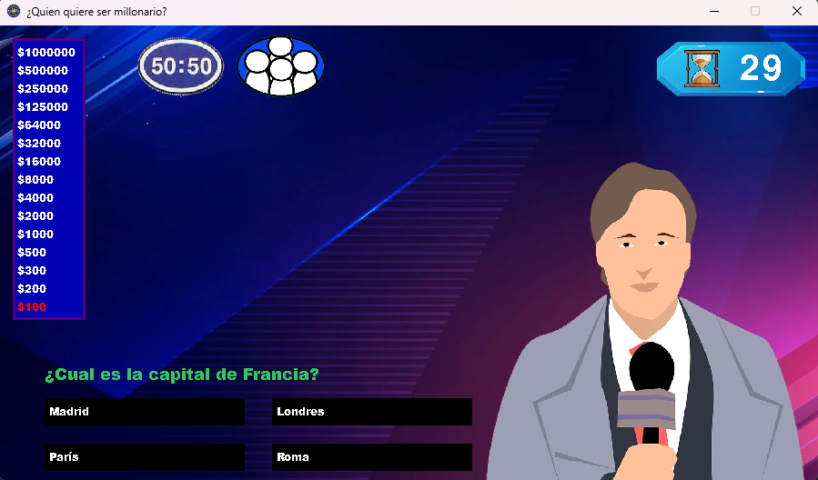

# 1er Parcial Programacion I

**🌈 DESCRIPCIÓN 🌈:**

¿Quien quiere ser millonario? Este juego contiene 15 preguntas de cultura general con 4 opciones por cada pregunta. El jugador va a elegir una opcion y si esta es correcta va a ir subiendo de nivel pudiendo llegar hasta el millon de dolares.
Cuando el tiempo esta entre 10 y 15 segundos, se presenta un mensaje en pantalla diciendo "tiene unicamente 30 segundo para jugar en cada pregunta".
Cuando responde correctamente y pasa a la siguiente pregunta el reloj se resetea a 0
El jugador pierde cuando se equivoca o llego a los 30 segundos.
El jugador cuenta con dos comodines (el público y el 50-50)
El jugador cuando llega al premio de 1000 o 32000 al jugador se le pregunta "¿Desea continuar o retirarse con lo obtenido?" Ya que si el jugador pierde no se lleva ningún premio.

----------------------------

**LINK DEL VIDEO 👾:**  https://www.youtube.com/watch?v=eN5wvIUkJCg

----------------------------

**FOTO DEL MENU 👑:**

](https://raw.githubusercontent.com/MatiasTanoni/QuienQuiereSerMillonario/refs/heads/master/imagenes/Captura%20de%20pantalla%202023-11-24%20190208.png))

**FOTO DEL JUEGO 🐧:**

